# Tim's Nix Configuration

```

██╗  ██╗ █████╗ ██████╗ ████████╗ ██████╗ ███████╗ █████╗             
██║ ██╔╝██╔══██╗██╔══██╗╚══██╔══╝██╔═══██╗╚══███╔╝██╔══██╗            
█████╔╝ ███████║██████╔╝   ██║   ██║   ██║  ███╔╝ ███████║            
██╔═██╗ ██╔══██║██╔══██╗   ██║   ██║   ██║ ███╔╝  ██╔══██║            
██║  ██╗██║  ██║██║  ██║   ██║   ╚██████╔╝███████╗██║  ██║            
╚═╝  ╚═╝╚═╝  ╚═╝╚═╝  ╚═╝   ╚═╝    ╚═════╝ ╚══════╝╚═╝  ╚═╝            
                                                                      
███╗   ██╗██╗██╗  ██╗ ██████╗ ███████╗ 
████╗  ██║██║╚██╗██╔╝██╔═══██╗██╔════╝
██╔██╗ ██║██║ ╚███╔╝ ██║   ██║███████╗
██║╚██╗██║██║ ██╔██╗ ██║   ██║╚════██║
██║ ╚████║██║██╔╝ ██╗╚██████╔╝███████║
╚═╝  ╚═══╝╚═╝╚═╝  ╚═╝ ╚═════╝ ╚══════╝

```

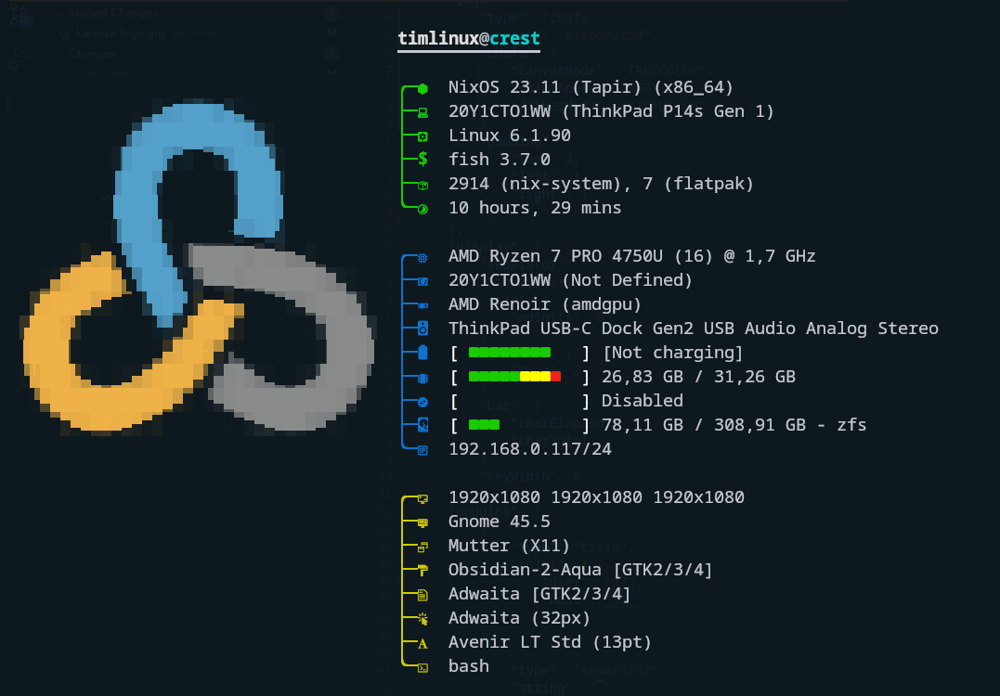

✂️💩 I know what I am here for, just give me the ❄️flake 🔗link! 💩✂️

```
nix run --extra-experimental-features nix-command --extra-experimental-features flakes github:timlinux/nix-config
```

Otherwise, please read on...


<!-- vscode-markdown-toc -->
* 1. [Background](#Background)
* 2. [What this repo provides](#Whatthisrepoprovides)
* 3. [Quickstart](#Quickstart)
	* 3.1. [Help documentation](#Helpdocumentation)
  * 3.2. [System management](#Systemmanagement)
  * 3.3. [System info](#Systeminfo)
  * 3.4. [Test VMS](#TestVMS)
  * 3.5. [System setup](#Systemsetup)  
  * 3.6. [About](#About)
* 4. [Listing this flake](#Listingthisflake)
* 5. [Setting up a new system](#Settingupanewsystem)
	* 5.1. [Preparation](#Preparation)
	* 5.2. [Wifi and browser](#Wifiandbrowser)
	* 5.3. [Launching the admin menu](#Launchingtheadminmenu)
	* 5.4. [Link your machine](#Linkyourmachine)
	* 5.5. [Format your disk](#Formatyourdisk)
	* 5.6. [Share your hardware config](#Shareyourhardwareconfig)
* 6. [Adding a new host to this flake](#Addinganewhosttothisflake)
	* 6.1. [The host file](#Thehostfile)
	* 6.2. [The user file](#Theuserfile)
	* 6.3. [The flake file](#Theflakefile)
	* 6.4. [Submitting your change](#Submittingyourchange)
	* 6.5. [Applying the flake to your system](#Applyingtheflaketoyoursystem)
* 7. [Existing hosts](#Existinghosts)
* 8. [Setting up a VM for testing](#SettingupaVMfortesting)
* 9. [Updating flakes](#Updatingflakes)
* 10. [Working with QGIS](#WorkingwithQGIS)
	* 10.1. [Choosing a version](#Choosingaversion)
	* 10.2. [Dynamically adding packages](#Dynamicallyaddingpackages)
	* 10.3. [Viewing the available python packages in QGIS](#ViewingtheavailablepythonpackagesinQGIS)
* 11. [The Utils Package](#TheUtilsPackage)
* 12. [Using packages from your own systems](#Usingpackagesfromyourownsystems)
* 13. [Resources](#Resources)

<!-- vscode-markdown-toc-config
	numbering=true
	autoSave=true
	/vscode-markdown-toc-config -->
<!-- /vscode-markdown-toc -->


📒 Note: Like most things in life, and in particular in open source, this work
is highly derivative. I tried to credit upstream sources in the various
configuration files provided here whenever possible.

##  1. <a name='Background'></a>Background

I started using NixOS in April 2023. I like keeping notes and making my work
repeatable, so NixOS is a good fit for my brain. This repository accumulates
the various things I put onto my computers and is going to be in a state of
continuous evolution. I am co-founder of a company called
[Kartoza](https://kartoza.com). We use NixOS on our linux workstations and 
this repository provides a canonical source of those configurations.

##  2. <a name='Whatthisrepoprovides'></a>What this repo provides

It's easier to start with a few screenshots!

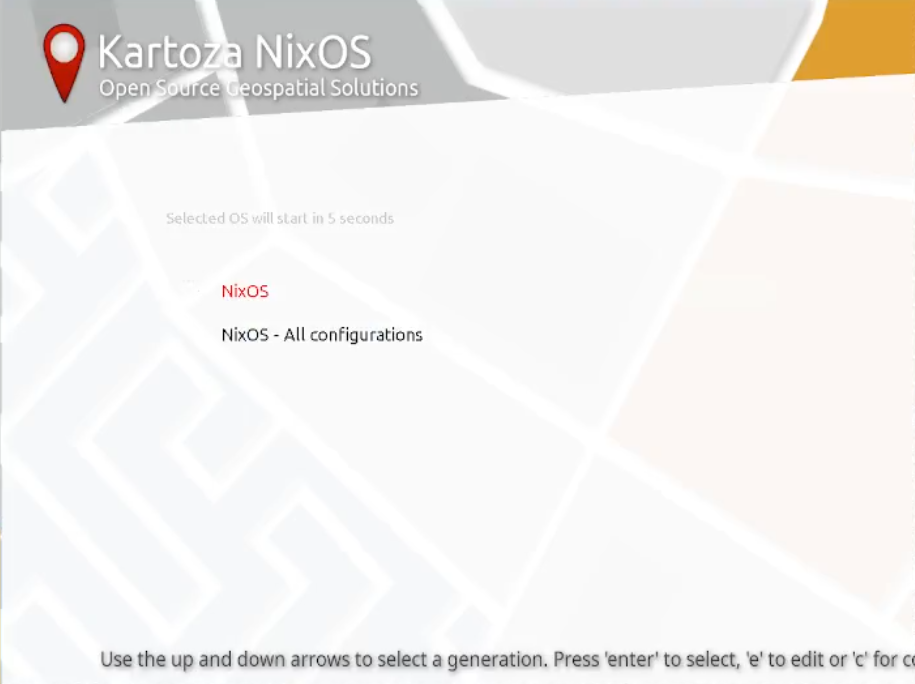

This is the boot menu, when you start your computer. From it you can 'roll' back to previous versions of your system before you made your last upgrade. Wait a few seconds and it will simply boot into your system.


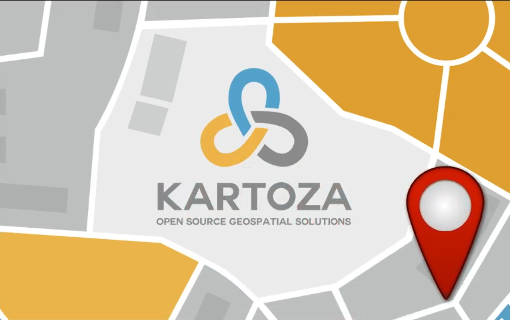

This is the boot splash screen. It will show a nice animation of a place marker while the system starts. It will also be here that you enter your disk encryption password. This flake provides all the tools you need to set up your disk with ZFS with encryption enabled.


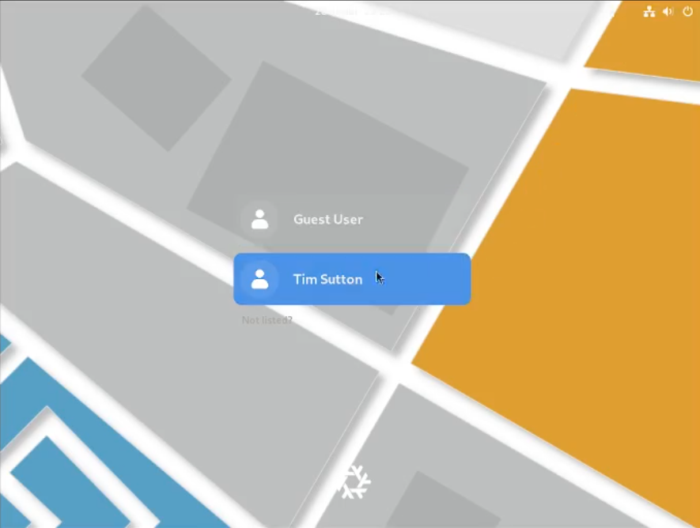

Once the boot process completes, you will arrive at our custom, Kartoza branded, login screen.


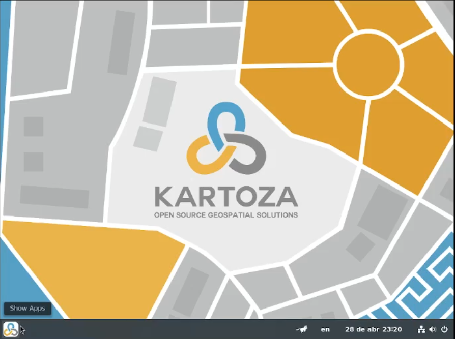

After logging in, your NixOS desktop awaits you! Get productive with the range of developer, GIS and productivity applications we pre-install on each system. Also tools for media creation (like OBS) are set up and ready to use.


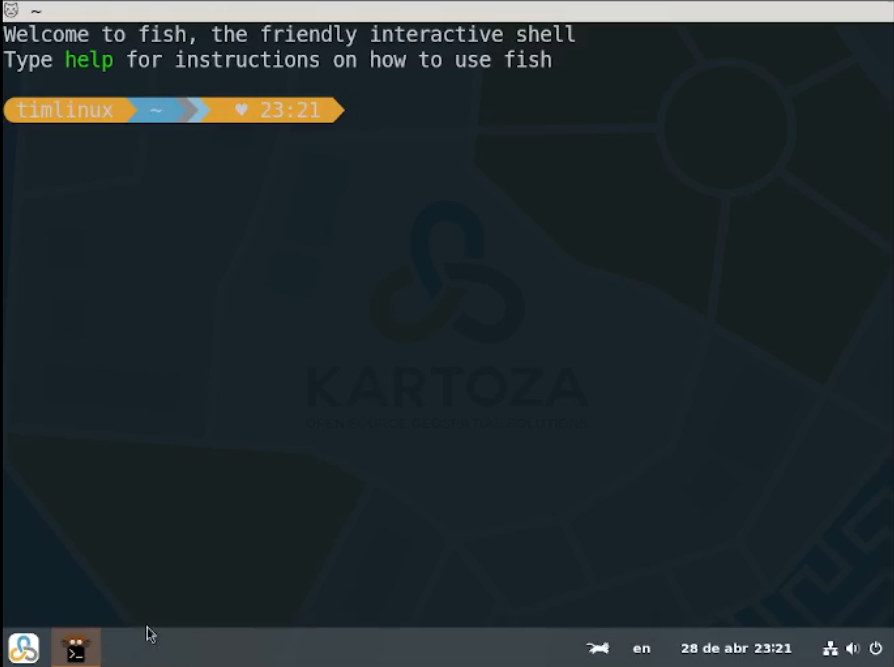


We have tried to make every part of the experience great. For example our shell customisations add a Kartoza branded starship bar to your shell prompt. Each system can have its own specific customisation, whilst all of our system enjoy a base line of useful functionality.


[📽️  Here is a walkthrough](https://www.youtube.com/watch?v=s59y0FOUN74) of setting up a VM with Kartoza NixOS.


This repo provides:

1. The flake that I use to set up a number of different systems that I manage.
2. Some custom packages that I use.
3. Many software packages which may prove useful for setting up things like zfs, OBS, Headscale and many other niceties.

##  3. <a name='Quickstart'></a>Quickstart

I have made a lovely menu / terminal app with all the key functionality provided by this flake:

Running the flake directly from github:

```
nix run --extra-experimental-features nix-command --extra-experimental-features flakes github:timlinux/nix-config
```

Or from a local checkout:

```
nix run .#
```

* 🏠️ Kartoza NixOS :: Main            
* Choose one:              
* 👉️💁🏽 Help                  
  * 🚀 System management  
  * ❓️ System info       
  * 🖥️ Test VMs           
  * 🛼 Create link        
  * 🛼 Enter link         
  * 🛼 Show value for key 
  * 🎬️ Make history video
  * 💿️ System setup   
  * 💡 About              
  * 🛑 Exit  


From here you can perform tasks from the listed sub menus:

###  3.1. <a name='Helpdocumentation'></a>Help documentation

* 👉️🏠️ Main menu                 
  * 📃 Documentation (in terminal)
  * 🌍️ Documentation (in browser)

Provides the documentation you are looking at on this page, either as console text or in your web browser.


Work through the items in sequence...

###  3.2. <a name='Systemmanagement'></a>System management

* 👉️🏠️ Main menu             
  * 🏃🏽 Update system        
  * 🦠 Virus scan your home   
  * 💿️ Backup ZFS to USB disk
  * 🧹 Clear disk space       
  * 💻️ Update firmware       
  * ❄️ Update flake lock      
  * ⚙️ Start syncthing        
  * 👀 Watch dconf            
  * 🎬️ Mimetypes diff 

Provides tools for configuring your system, starting services, setting up your VPN etc.

###  3.3. <a name='Systeminfo'></a>System info

* 👉️🏠️ Main menu                            
  * 💻️ Generate your system hardware profile
  * 🗃️ General system info                   
  * 💿️ List disk partitions                 
  * 🏃🏽 Generate CPU Benchmark              
  * 🚢 Open ports - nmap                     
  * 🚢 Open ports - netstat                  
  * 📃 Live system logs                      
  * 😺 Git stats                             
  * 👨🏽‍🏫 GitHub user info                  
  * 🌐 Your ISP and IP                       
  * 🐿️ CPU info                              
  * 🐏 RAM info                              
  * ⭐️ Show me a star constellation 

Provides diagnostic and informative information about your system.


###  3.4. <a name='TestVMS'></a>Test VMS

* 👉️🏠️ Main menu                              
  * 🏗️ Build Kartoza NixOS ISO                 
  * ❄️ Run Kartoza NixOS ISO                   
  * 🖥️ Minimal Gnome VM                        
  * 🖥️ Full Gnome VM                           
  * 🖥️ Minimal KDE-5 VM                        
  * 🖥️ Minimal KDE-6 VM                        
  * 🖥️ Complete Gnome VM (for screen recording)

Builds and provides test VMs that you can use to try out variants of this flake.

###  3.5. <a name='Systemsetup'></a>System setup

* 👉️🏠️ Main menu               
  * 🛼 Enter link               
  * 🌐 Set up VPN               
  * 🔑 Install Tim's SSH keys   
  * 💿️ Checkout Nix flake      
  * 🏠️ Show your VPN IP address
  * 🪪 Generate host id          
  * ⚠️ Format disk with ZFS ⚠️  
  * 🖥️ Install system   

Tools for setting up a new system from scratch. Assumes an 
admin is available to provide you with VPN connection details
etc. and to set up your skate link.

###  3.6. <a name='About'></a>About


📽️ Please see the [Video Walkthrough](https://youtu.be/kR54Gbr-ZP0) I made of the Utils menu for more details on the above.

##  4. <a name='Listingthisflake'></a>Listing this flake

You can list the flakes like this:

```
nix flake show github:timlinux/nix-config
```

Or if you want to refer to a git branch, add it to the end of the URL e.g. for a branch called 'flakes':

```
nix flake show github:timlinux/nix-config/flakes
```

You will get something like this in the output (most likely changed since I write this):

```
github:timlinux/nix-config/857473686683ca6b2b2ce713fa7807da470054c6
├───devShells
│   └───x86_64-linux
│       └───default: development environment 'nix-shell'
├───nixosConfigurations
│   ├───atoll: NixOS configuration
│   ├───crater: NixOS configuration
│   ├───crest: NixOS configuration
│   ├───jeff: NixOS configuration
│   ├───live: NixOS configuration
│   ├───rock: NixOS configuration
│   ├───test-gnome-full: NixOS configuration
│   ├───test-gnome-minimal: NixOS configuration
│   ├───test-kde5: NixOS configuration
│   ├───test-kde6: NixOS configuration
│   ├───valley: NixOS configuration
│   └───waterfall: NixOS configuration
└───packages
    └───x86_64-linux
        ├───default: package 'utils'
        ├───gverify: package 'gverify-1.0'
        ├───qgis: package 'qgis-3.36.2'
        ├───qgis-python-shell: package 'nix-shell'
        ├───runme: package 'runme'
        ├───setup-zfs-machine: package 'setup-host-with-zfs'
        └───tilemaker: package 'tilemaker-master'
```

If you wish to just install one of the packages provided in this flake onto your own system you can do this:

```
nix build --extra-experimental-features nix-command --extra-experimental-features flakes github:timlinux/nix-config#gverify
nix profile install --extra-experimental-features nix-command --extra-experimental-features flakes github:timlinux/nix-config#gverify
```


##  5. <a name='Settingupanewsystem'></a>Setting up a new system

The workflow for setting up a new system is described in the following diagram:

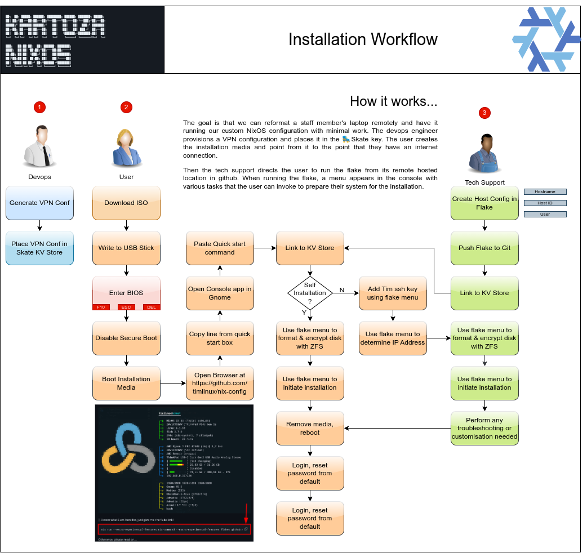

###  5.1. <a name='Preparation'></a>Preparation

For our setup session, we are going to be wiping and reloading your laptop with the standard Kartoza software stack.

**Before the session:** Please download the NixOS installer from [here](https://channels.nixos.org/nixos-23.11/latest-nixos-gnome-x86_64-linux.iso)

After you have downloaded the file, you need to image it onto a USB memory stick. You can use etcher for this, which you can download here: 
https://etcher.balena.io/


**During the session:**

* We will be ⚠️wiping and reinstalling the kartoza laptop⚠️. 
* Make sure you do not have any 👨🏽‍🏫 personal data on it. 
* Until the laptop is has completed its initial setup, you will need ☎️ another device to talk to me on in our call if we are setting it up together. 
* You will also need a good 🌐 internet connection as the total install downloads around 8GB of packages. 
* You will also need to be on a reliable 🔌 power source since if you run out of power halfway through the install process, you will likely need to restart from the beginning. 
* As for all Kartoza collaboration, please ensure you are in a 🔇 quiet place where you can hear and be heard clearly.

###  5.2. <a name='Wifiandbrowser'></a>Wifi and browser

If needed, connect your computer to the internet use the network and wifi options that can be found off the menu in the top right corner of the screen:

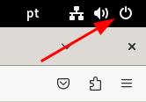

Once your computer is started from the USB disk, open a web browser and open this page so that you can cut and paste commands.

###  5.3. <a name='Launchingtheadminmenu'></a>Launching the admin menu

Then open a terminal window and paste this command:

```
nix run --extra-experimental-features nix-command --extra-experimental-features flakes github:timlinux/nix-config
```

The admin menu should appear after a few moments. From now on, when you see instructions preceded with 👉️, know that that is a menu option you should be chosing.

📒 Note: If you drop out of the menu for some reason, simply restart it using the above command by pressing the up arrow on your keyboard, then press enter when you see the ``nix run`` command above.

###  5.4. <a name='Linkyourmachine'></a>Link your machine

Before doing anything else, we will link your machine to the key / value store so that we can share data conveniently. We use a tool called "🛼 skate" for this.

1. 👉️ 🏠️ Kartoza NixOS :: Main Menu
2. 👉️ 🛼 Enter link

At the prompt, enter the link, exactly as provided (case sensitive).

###  5.5. <a name='Formatyourdisk'></a>Format your disk

⚠️ All data on your disk will be lost!!! ⚠️


1. 👉️ 🏠️ Kartoza NixOS :: Main Menu 
2. 👉️ 🚀 System management
3. 👉️ ⚠️ Format disk with ZFS ⚠️

Now follow the prompts as directed. This will scrub your disks and reformat them with ZFS. This is the recommended way to set up your system for the first time.

I *highly* recommend that you encrypt your system. Non-encrypted disks should only be used in special circumstances where unlocking the disk during boot up is not possible.

>💡 **Technical notes on the ZFS setup script:** The script is based on great examples I found online, though with substantial updates on my part. The script will completely set up new hosts with ZFS, encrytion, flakes and various other niceties. You can find this script in
[``packages/setup-zfs-machine/``](packages/setup-zfs-machine/) - check the [README.md](packages/setup-zfs-machine/README.md) there first as it explains how the script can be used independently of this flake if you desire.

Each system added to this repo should be validated in the table further down in this document. Currently validation is manual, unfortunately.

⏰ The setup process may take quite some time. Just be patient and wait while everything downloads.

###  5.6. <a name='Shareyourhardwareconfig'></a>Share your hardware config

If your system is already described in the flake hosts folder, you do not need to do this step, you can skip down to [Existing hosts](#Existinghosts). If it is a first time deployment, you can share the hardware configuration with your technical support so that we can create a host config for you go to the system info menu and generate a hardware configuration:

1. 👉️ 🏠️ Kartoza NixOS :: Main Menu 
2. 👉️❓️ System info
3. 👉️💻️ Generate your system hardware profile

You will be prompted to share your configuration on the 🛼Skate key/value store.


After sharing your hardware configs, we may make some quick updates to your system configs. After that, you can reboot.


##  6. <a name='Addinganewhosttothisflake'></a>Adding a new host to this flake

Since this is a new system  being added to our fleet, there are a few steps to perform when adding a new host to this flake:

1. Create the **host** file e.g. ``hosts/mountain.nix``.
2. Create the user file  e.g. ``users/tim.nix``
3. Add the host to the ``flake.nix``


###  6.1. <a name='Thehostfile'></a>The host file

Create a new host file in hosts e.g.

```
touch hosts/mountain.nix
```
The newly created file should exactly match the hostname when you deploy the host. The hostname is configured during the ZFS formatting step. The easiest is to copy over an existing config from another host and then mix in the machine specific details found in the ``hardware-configuration.nix`` (see the previous section for more info). The hardware configuration can be retrieved from the menu system when running the flake:

```
nix run
```

* ❓️ System info
* 👉️💻️ Generate your system hardware profile
* 🛼 Would you like to store your the value for hardware-config in our distributed key/value store'? 

There are a few edits you need to make to this file to provide:

**A network id for your ZFS pool**

See [this link](https://search.nixos.org/options?channel=unstable&show=networking..hostId&query=networking.hostId). You can generate a unique host id using this:


* 👉️🏠️ Main menu 
* 👉️💿️ System setup
* 👉️🪪 Generate host id

It will automatically be saved as the 👉️<hostname>-machine-id  in the 🛼 Skate key value store. Place the entry in your <hostname>.nix file. e.g.

```
networking.hostId = "d13e0d41"; # needed for zfs
```

**A hostname**

This should exactly match the hostname of your system. For example:


```
networking.hostName = "crest"; # Define your hostname.
```
  

**Additional imports to define your desktop environment etc.**

The scheme of this flake provides three main types of imports:

1. **configurations** - these are meta collections of components to e.g. set up your desktop environment or a suite of applications.
2. **software** - these are atomic units of functionality you can add to your system. Many of them will be added though your chosen configuration, but you may choose to add specific software. For example locale, biometrics etc.

The software is organised in categories:

```
tree -d -L1 software
software
├── console-apps # e.g. fish shell, vim etc.
├── desktop-apps # e.g. gnome circle apps, any other gui apps
├── desktop-apps-unstable # software from the unstable nix channel
├── desktop-environments # a whole bunch to try: gnome, kde, budgie etc.
├── developer # python and other developer specific software
├── games # steam, retroarch and some games from Nix packages
├── gis # QGIS and the like
└── system # fonts, services etc.
```

3. **users** - This is a list of one or more users that you want to have accounts on your system.

There is no "one size fits all" here, but a good starting point will be to look at other hosts and copy their config. For example, here is my list of imports for my system which has a fingerprint reader (needs to be a linux supported reader), a Portuguese keyboard and zfs with encryption enabled:

```
  imports = [
    (modulesPath + "/installer/scan/not-detected.nix")
    ../configuration/desktop-gnome.nix
    ../configuration/desktop-apps.nix
    ../software/system/locale-pt-en.nix
    ../software/system/biometrics.nix
    ../software/system/zfs-encryption.nix
    ../software/unstable-apps # qgis, keepasxc, vscode, uxplay
    ../users/tim.nix
  ];
```

See the next section for more details about the user file.

###  6.2. <a name='Theuserfile'></a>The user file

This file should be added into the ``users`` folder if needed. Name the file after the user's name e.g. ``tim.nix``. It is probably easiest to just copy one of the existing users and adapt it.

The users file file configures your user name, home-manager options and your user groups. For the most part, you can simply copy an existing user file and then replace all instances of the old user name with your user name.


###  6.3. <a name='Theflakefile'></a>The flake file

You need to copy in a new entry for your host into ``flake.nix`` e.g.

```
      # Tim headless box
      valley = nixpkgs.lib.nixosSystem {
        specialArgs = specialArgs;
        system = system;
        modules = shared-modules ++ [./hosts/valley.nix];
      };
```

Then replace the comment and shared modules to reference the new host you have created.

###  6.4. <a name='Submittingyourchange'></a>Submitting your change

Finally, your edits to the flake and other file changes need to be upstreamed to our git repo. Follow normal git workflows for doing that. I recommend adding your host to the existing hosts list in the next section so the expected behaviour for that host is clear.

###  6.5. <a name='Applyingtheflaketoyoursystem'></a>Applying the flake to your system

For new installations, make sure all of the steps above were done before the setup process begins on the user's pc and then run these tasks:

* 🏠️ Kartoza NixOS :: Main Menu 
* 👉️💿️ System setup
*   💿️ Checkout Nix flake      
* Ctrl-C

```
cd ~/dev/nix-config
nix run
```

* 🏠️ Kartoza NixOS :: Main Menu 
* 👉️💿️ System setup
* 🖥️ Install system           


If it is an existing installation, simply call the script provided in the root of this flake directory to then apply the changes to your system:

```
nix run
```

Then:

1. 🚀 System management
2. 🏃🏽 Update system


Applying the flake may take some time depending on your internet connection and whether it needs to compile stuff.

Once the installation completes, reboot and you should be experiencing a nice Kartoza branded experience all the way through the boot up and log in process.

If you experience any issues, remember that you can always select a previous generation at the initial start of your system and then boot into your old environment.

##  7. <a name='Existinghosts'></a>Existing hosts 

| Host | Model | Ram | Encrypt | Flake | ZFS | Users | Pass | Works | Notes |
|---|---|---|---|---|---|----|---|---|---|
| nixos | qemu vm  | 2GB | 🔴 | 🟢 | 🔴 | guest | guest | ✔️ |  Generic install created for testing in VMS. |
| rock| virtman vm   | 8GB | 🟢| 🟢| 🟢 | guest|guest| ✔️ | Production install for learning NixOS etc. |
| valley| i3 Intel Nuc |16GB   | 🟢| 🟢|  🟢 | timlinux|-| ✔️ | Adguard and retroarch |
| crest| Thinkpad P14S | 32GB   | 🟢| 🟢|  🟢 | timlinux|-| ✔️ | My daily workhorse |
| atoll| Dell Inspiron 14 7430 2in1 | 16GB   | 🟢| 🟢|  🟢 | dorah |-| ✔️ | Dorah's laptop |
| crater |  Dell P157G Inspiron | 16GB   | 🟢| 🟢|  🔴 | eli |-| ✔️ | Eli's laptop |
| ??? |   | 16GB   | 🟢| 🟢|  🔴 | amy |-| ✔️ | Amy's laptop |
| ??? |   | 16GB   | 🟢| 🟢|  🔴 | jeff |-| ✔️ | Jeffs's laptop - running kde plasma |


##  8. <a name='SettingupaVMfortesting'></a>Setting up a VM for testing

Use the 'rock' profile described above and follow these steps:

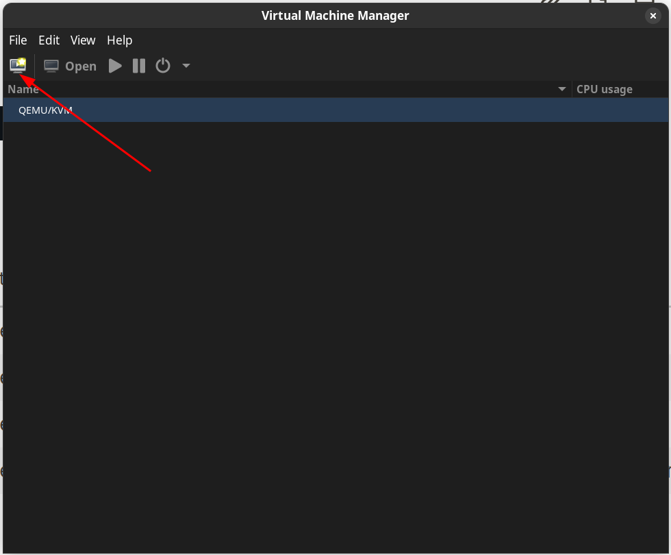

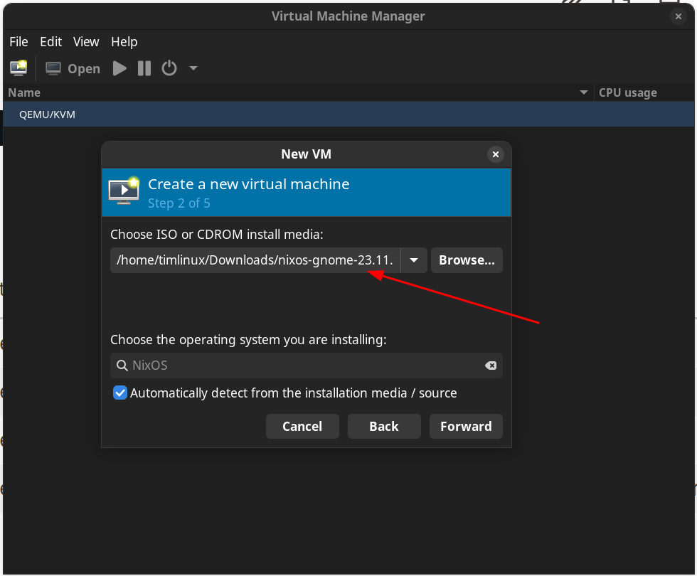
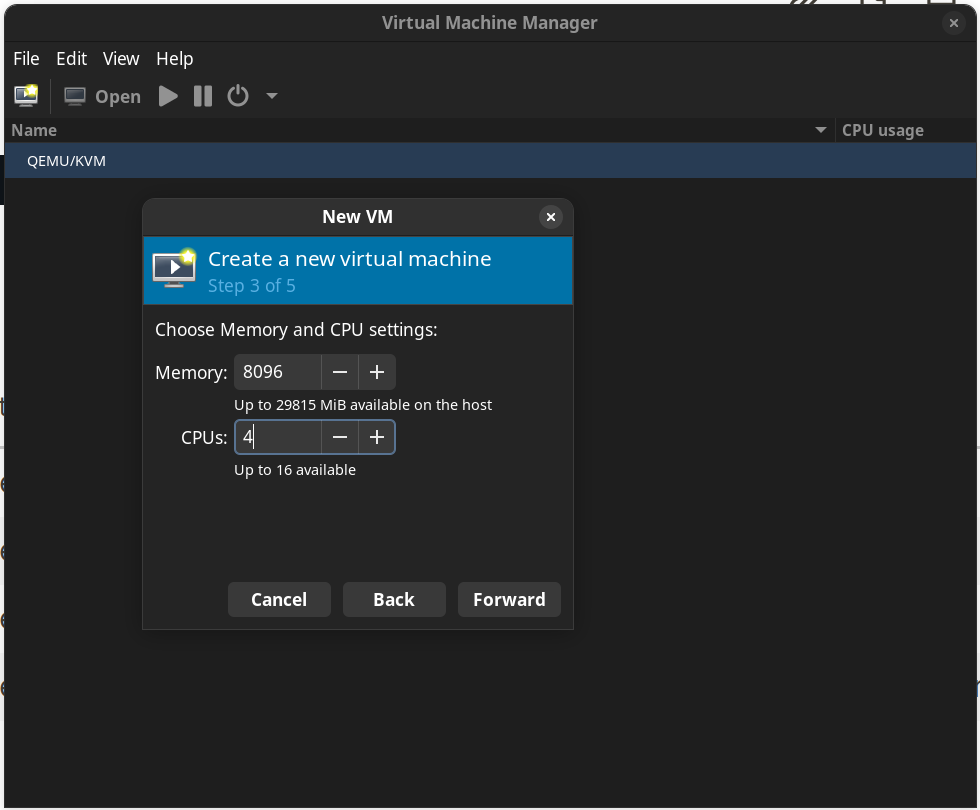
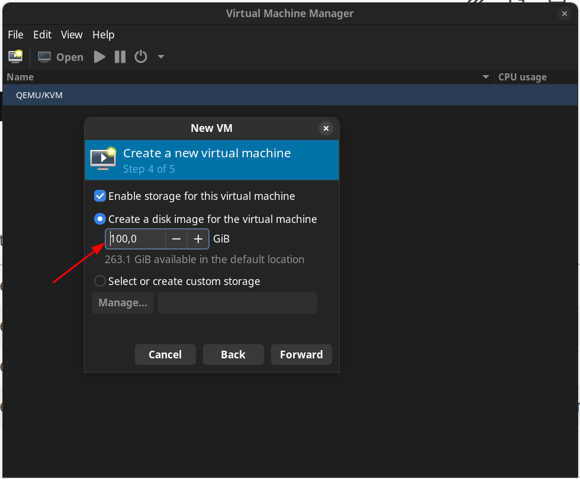
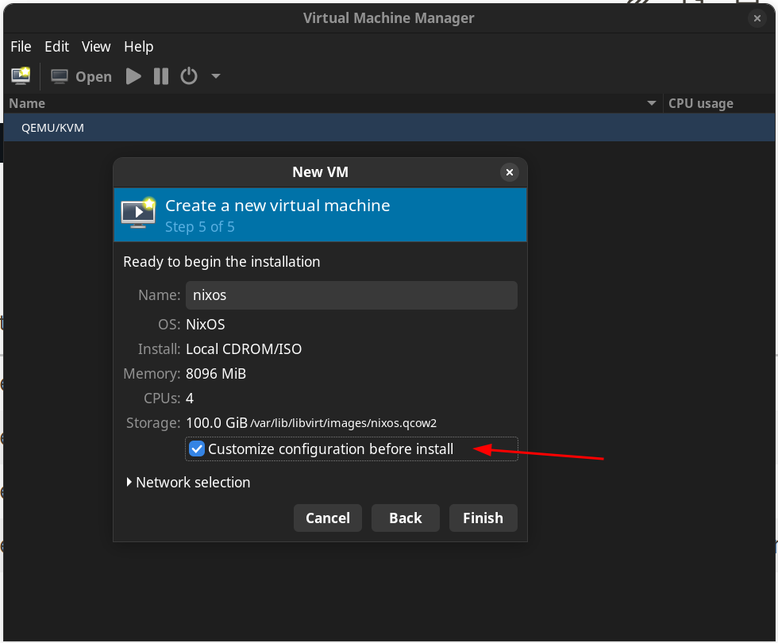
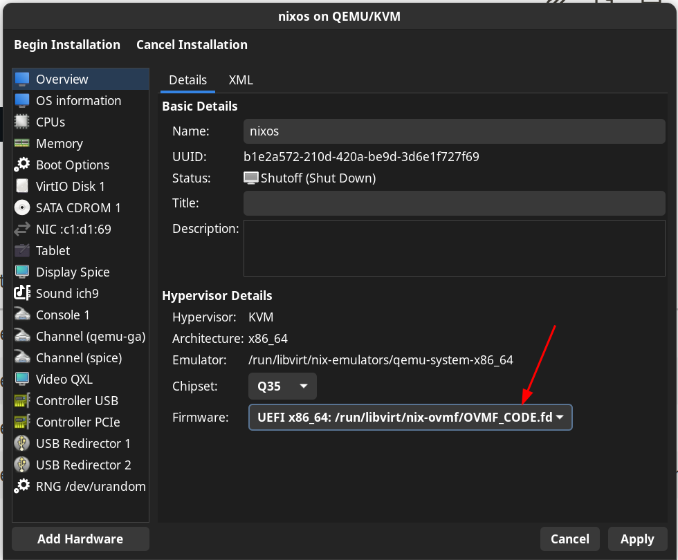
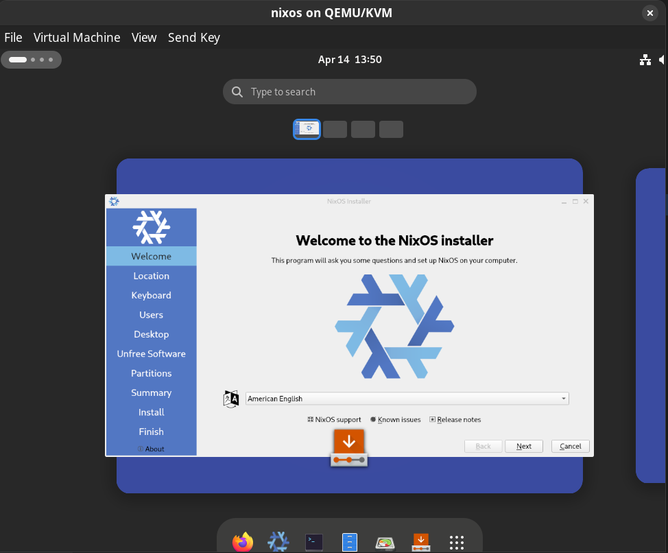
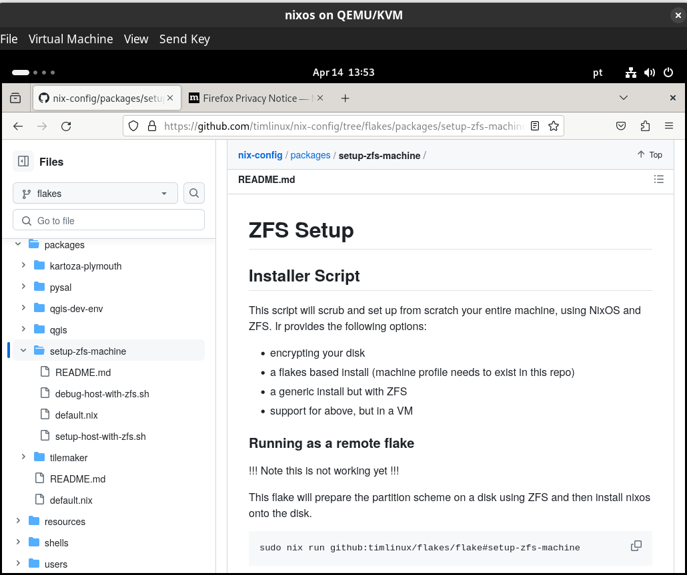

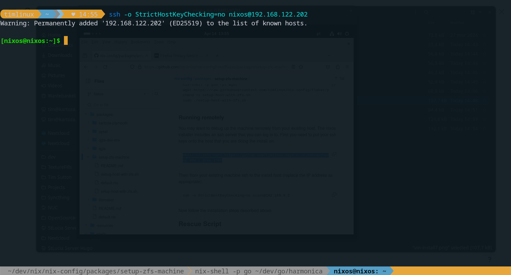


##  9. <a name='Updatingflakes'></a>Updating flakes

If the flake has been modified in this repo, you can update it like this:

```
nix flake update github:timlinux/nix-config
```

or for a git branch e.g. 'flakes' branch:

```
nix flake update github:timlinux/nix-config/flakes
```


##  10. <a name='WorkingwithQGIS'></a>Working with QGIS

###  10.1. <a name='Choosingaversion'></a>Choosing a version

There are 3 options for installing QGIS:

1. Install the nix cache stable version - no special setup is needed, just include the ``software/qgis-stable.nix`` module.
2. Install the nix cache  unstable version - no special setup is needed, just include the ``software/unstable-apps/qgis-unstable.nix`` module. This version is also provided by default in ``software/unstable-apps/default.nix`` (see example below). Note that unstable does not speak to the quality of the QGIS release, only to the fact that the package is provided from the Nix unstable repository.
3. Install my custom QGIS version - I have made a custom QGIS build which bundles in extra pythoon packages and gives me a space to 
customise it as wanted. To use it add include the ``software/qgis-sourcebuild.nix`` module (see example below)


📒 Some notes

1. Option 3 will perform a full source compile which is going to use a bunch of resources on your computer - it could take like an hour or more depending on your processor speed.
2. None of the configurations include QGIS by default so you need to add it to your host - either add it separately to your host/<hostname>.nix depending on which option you prefer, or add the group of unstable apps which will include the qgis-unstable upstream build. Here is an example from my host:


```
  imports = [
    (modulesPath + "/installer/scan/not-detected.nix")
    ../configuration/desktop-gnome-x11.nix
    ../configuration/desktop-apps.nix
    ../software/locale-pt-en.nix
    ../software/biometrics.nix
    ../software/zfs-encryption.nix
    #../software/unstable-apps # qgis, keepasxc, vscode, uxplay

    # I do it this way so that we use hand compiled QGIS with
    # all the extra goodies I want like pyqtgraph
    # rasterio, debug libs etc. available to the build of QGIS
    # Note that it is mutually exclusive (for now) to the upstream
    # QGIS binaries and also the build may take quite a while on
    # your pc.   If you prefer to use the upstream built binary,
    # you can comment out these next 4 lines and uncomment the
    # unstable-apps entry above.
    ../software/keepassxc-unstable.nix
    ../software/vscode-unstable.nix
    ../software/uxplay-unstable.nix
    ../software/qgis-sourcebuild.nix
    ../users/tim.nix
  ];
  ```

###  10.2. <a name='Dynamicallyaddingpackages'></a>Dynamically adding packages


If you want more python packages to be available in your QGIS, you can either modify the custom version as indicated in the section above, or you can use an overlay when launching QGIS like this:

```
nix-shell -p \
  'qgis.override { extraPythonPackages = (ps: [ ps.numpy ps.future ps.geopandas ps.rasterio ]);}' \
  --command "qgis"
```

###  10.3. <a name='ViewingtheavailablepythonpackagesinQGIS'></a>Viewing the available python packages in QGIS

You can view the packages in the QGIS Python console like this:

```
import pkg_resources
 
installed_packages = pkg_resources.working_set
for package in installed_packages:
    print(f"{package.key}=={package.version}")
```


##  11. <a name='TheUtilsPackage'></a>The Utils Package

I have written a package called 'utils' which is a starting point for managing your system.

You can invoke it using ``nix run``

##  12. <a name='Usingpackagesfromyourownsystems'></a>Using packages from your own systems

You don't need to directly use this flake to benefit from the packages it defines. Here is an example of how you can use the package:

Save as e.g. ``gverify.nix``

```
{ config, pkgs, ... }:
{
  environment.systemPackages = with pkgs; [
    # Other packages...
    (fetchFromGitHub {
      owner = "timlinux";
      repo = "nix-config";
      # nix-shell -p nix-prefetch-git --command "nix-prefetch-git --url https://github.com/timlinux/nix-config" | grep "hash is"
      rev = "0wj7hvlg1gp8dj0prrx8332pbz57lfp7kbk7654czbis4wjh06j4";
      # Optionally, you can specify a specific subdirectory
      # subdir = "packages";
    }).gverify  # Replace `packageName` with the actual name of the package you want to include
  ];
}
```

Then in your ``configuration.nix`` add ``gverify.nix`` to your ``imports`` list.


##  13. <a name='Resources'></a>Resources

I found some resouces particularly valuable in my learning journey, I will try to assemble them here:

1. 📺️ [Chris McDonough's YouTube Channel](https://www.youtube.com/@ChrisMcDonough) - so many great videos that patiently walk through key activities in setting up different aspects of NixOS.
2. 📝 [Determinate Systems Blog](https://determinate.systems/posts) - many interesting and useful hints and tips to get the most out of NixOS.
3. 🎒 [Zero To Nix](https://zero-to-nix.com/) - nice learning resource for those starting out in NixOS.
4. ⭐️ [Wimpysworld](https://github.com/wimpysworld/nix-config) - An absolute goldmine of snippets and a beautifully written README.
5. 📃 [Flakes Diagram](https://coggle.it/diagram/ZVZ3rq_HfWTHL4b3/t/nix-flakes/598940443cb9f2e50a4d9cee02eaa7822355d5248faa9dde969406fe9341103f) - A fantastic schematic describing what a flake is.

Lastly, here is a little history of this repo:


