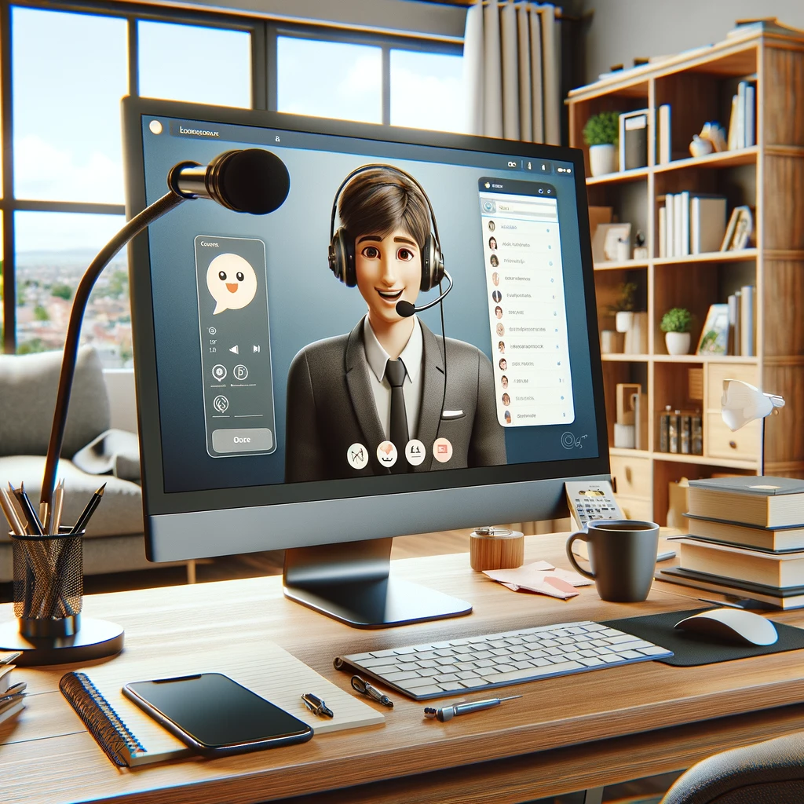
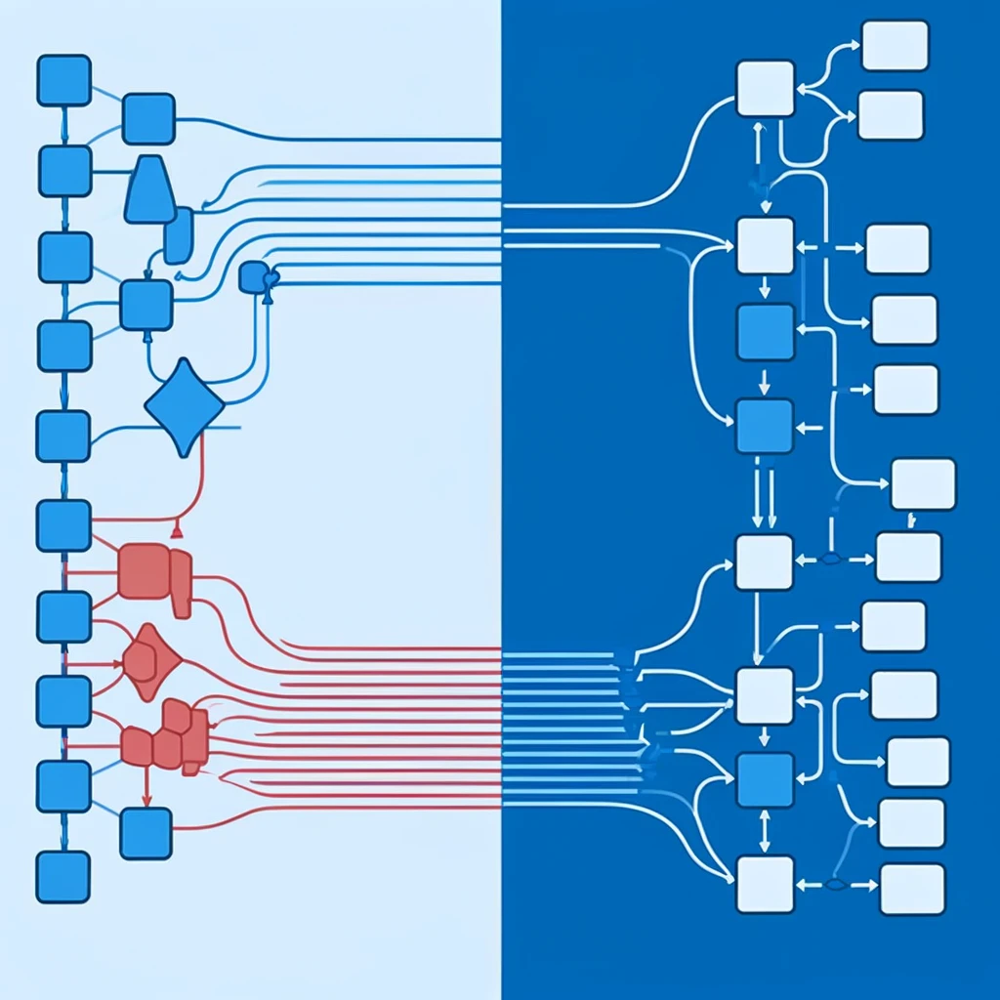
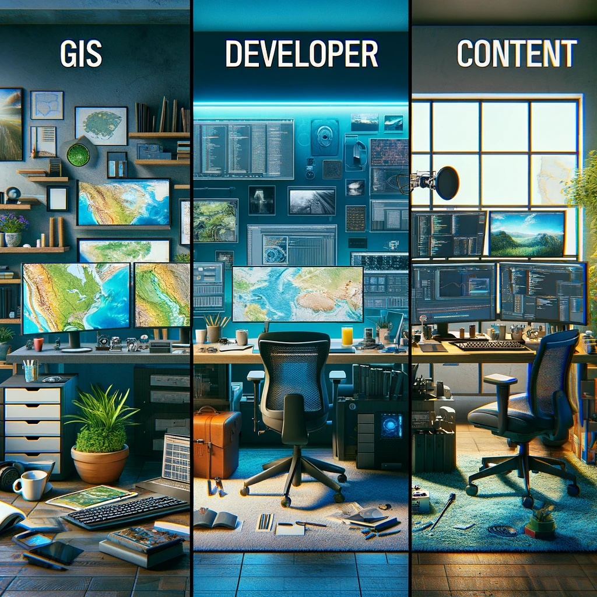

# Kartoza Desktop Strategy

A plan to normalise our work environment.

---

# Standardized Environments

Standardization: Simplifying Support & Enhancing Security

---

# Security and Compliance

Built-in Security: Compliance with Kartoza Standards
* KeePassXC
* Firewall
* VPN
* Disk encryption etc.

---

# Reducing Variability

Reducing Variability: Consistent Systems Across the Board

---

# Ease of Support

Streamlined Support for Remote Workforce
* Deploy fixes via GIT
* Direct machine access when needed
* Single support target

---

# Branding and Professionalism

Our branding will show on:
* Screen shares
* Training sessions
* Screen captures

Staff will sense they are 'at work'

---

# Efficiency

Efficient development env.

* Direct on NixOS, No VM needed for most cases
* 'Out the box' developer tools (docker, vm, shells, direnv)
* nix.shell & shell.nix is awesome!

---

# Community and Flexibility

We can establish and internal community around 'our' operating system.

Staff can participate in shaping the environment we all use.

---

# Misconceptions

NixOS is no harder to use than any other distro.

Most users will not even know they are using NixOS vs Ubuntu or another distro.

---

# Remote Management

Systems with ZFS can push encrypted backups to a remote NAS.

We can support users remotely via VPN and SSH.

---

# Media Creation Experience

Optimized for Media: Create and Innovate Effortlessly

---

# Supporting Work Modalities

* Admin staff
* Developers
* GIS staff 
* Devops
* Interns
* Training
* Media creation

---

# Conclusion

Another step in the growth and maturity of Kartoza following initives like:
* ERP and efficient admin
* Devops and carefully managed infrastructure
* Training strategy overhaul

