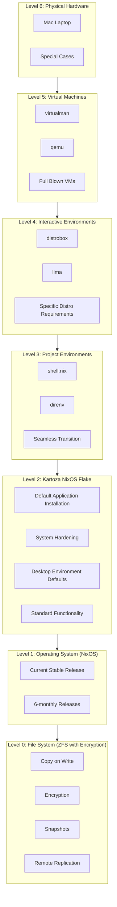

# Kartoza OS - A Kartoza White Paper

!

Tim Sutton, May 2024

## Abstract:

This document outlines the strategic benefits and operational enhancements proposed through the adoption of a standardised Operating System within Kartoza (henceforth referred to as "Kartoza OS"). It addresses key arguments supporting the transition to Kartoza OS as a standard environment for our user desktop environments, tackles common concerns through an FAQ section, and projects future initiatives to further standardize, improve and secure our IT environment. 

The primary aims of this initiative are to:

* provide a pleasant desktop experience, 
* enhance efficiency, 
* reduce variability, 
* ensure a secure, standardized IT infrastructure framework,
* supports remote work and provide remote support,
* and, scale effectively as Kartoza grows.

This document outlines the rationale for the eventual transition of all staff to a managed desktop environment and the looks ahead to the future of next steps we might take once we have achieved this.

    "The electric light did not come from 
     the continuous improvement of candles." 
     - Oren Harari

    "If I had asked people what they wanted, 
     they would have said faster horses." 
     - Henry Ford

    "Any sufficiently advanced technology 
     is indistinguishable from magic." 
     - Arthur C. Clarke

## Background

Allowing users to choose their own operating system and customise their environment can increase their sense of self-agency and independence, especially if they're accustomed to a specific environment. This flexibility can be great for user satisfaction but might introduce variability that complicates support and security management, causes organisational friction, and misses opportunities to promote our deep technical skills in new and innovative ways.

Additionally, it places a high burden on users to be their own sys admin - something that is often not feasible for users with less technical knowledge and a distraction from production work for those who are more technical.

In this document, I am proposing a standardized Kartoza OS, implemented using a NixOS 'flake' based linux distribution. The eventual goal will be to make it provisioned to all staff for use as their desktop machines. This document will explore the benefits of this approach and specifically NixOS as a choice for this platform.

## Value Proposition

Linux in general, and NixOS specifically offers a high degree of control over the operating system environment, which can significantly reduce variability and risk. Also, NixOS’s configuration management capabilities will help to ensure that all systems are equipped with all the software they are expected to have installed (inline with our company policies) right from the start.

Our company has a diverse set of requirements:

* **Admin activities:** Billing, time tracking, accounting, client management, business management.
* **GIS Practice:** Using tools like QGIS, GDAL, PostGIS, Python, R, bash scripts etc. to support our customers with their GIS needs.
* **Developers:** Our developers target web, desktop and mobile development. They use docker and either PyCharm Pro or VSCode.
* **Media:** We do things like hosting the QGIS Open Day each month, creating tutorials and screencasts, making flyers, banners, logos, web and desktop wireframes and many other creative things. We use tools like OBS, Gimp, Kdenlive, Draw.io, Synfig and many more.
* **Devops and Sysadmin:** We administer many servers via automation tools like Kubernetes or 'the old fashioned way' using SSH and linux command line tools.
* **Training:** We provide training services, both in person and remotely. We develop training resources on our Moodle platform or as standalone worksheets and media resources.
* **Productivity:** We use spreadsheets and word documents to colloborate with our clients and each other, prepare proposals and develop ideas.
* **R&D:** We need to be able to create ad hoc environments for prototyping ideas and 'figuring stuff out'. When we do this, the changes we make should not 'pollute' our systems which also have production environments on them.

Our team is diverse and distributed:

* We are spread around the world, everyone works remotely.
* There is no central office. We do have some centralised infrastructure to provide our back office environment. This is hosted on VPS instances.
* The ICT skills of our team range from 'serious guru' to 'capable'.

The value proposition of this document is this to provide a solution that:

* caters to individualised preferences (e.g. I need package xyz that nobody else needs)
* provides everything staff need to get their work done, with minimal friction
* provides a good level of security, catering for best practices like using password managers 'out the box'
* provides the ability to remotely manage and support staff PCs
* minimizes the cost (time and money) of supporting our users in the transition to a standardised work platform
* uses automation and declarative principles to ensure that the experience we provide each staff member is repeatable
* offers a great user experience with a performant, rich desktop environment

This document only targets desktop workloads. Future iterations will target standardising hardware in our company, container workloads, and potentially the servers running containers.

## The solution

The solution provided will consist of:

* **Level 0**: The underlying file system. We will use ZFS with encryption. ZFS provides 4 key features which interest us:
    * copy on write: this provides grately enhanced data integrity in case of e.g. sudden power outage.
    * encryption: the root and home environments can be securely encrypted.
    * snapshots: with sanoid, the system will be setup to provide regular snapshots that provide another level of data integrity and point-in-time recovery
    * remote replication: we will be providing access to a NAS where our staff can back up their home partition using encrypted, efficient remote backups
* **Level 1**: The underlying operating system, NixOS, tracking the current stable release. NixOS releases are at 6 monthly intervals which provides a nice cadence of being 'fresh' without needing continual change management.
* **Level 2**: The Kartoza NixOS flake (as provided in this repository) that provides a default installation of applications, hardens the system, provides application and desktop environment defaults and generally defines the broad set of standard functionaly that all users will have available to them.
* **Level 3**: shell.nix and direnv environments for each customer and internal project that provide seamless transition into each project's development environment.
* **Level 4**: distrobox / lima or similar interactive environments based on popular linux distributions for the few edge cases where a specific distro is needed to carry out your work.
* **Level 5**: virtualman / qemu etc for when a 'full blown' virtual machine is needed to carry out your work. These will be uncommon exceptions rather than common practice.
* **Level 6**: physical hardware e.g. a mac laptop for those few cases where work simply cannot be carried out in the environment we provide.

## Concerns and considerations

### Standardisation Versus Individuality

Our NixOS approach offers a system that balances the need for standardization with the potential for individual contributions and flexibility. By using a shared Git repository for your NixOS configurations, we are allowing for a collaborative approach to system management. 

Users who are technically adept can directly contribute to the system's evolution, while those who are less technical still have a pathway to suggest changes that can be implemented by the more experienced team members. This can help mitigate feelings of restriction and loss of individuality, as it gives everyone a voice in the development of their work environment.

This approach also keeps our configurations transparent and version-controlled, which is great for identifying when issues may have been introduced, and for providing rollbacks in case something goes wrong. 

Changes can be proposed, reviewed, and deployed, using the standard Kartoza project board / PR / issue creation etc. workflows, ensuring that updates are managed in an organised way without compromising the system's stability or security.

### Branded Experience

We want to create a branded experience for our staff. Since we are all remote workers, our computer is essentially our office.

Standardizing the desktop environment with Kartoza branding not only reinforces the professional context but also ensures consistency and a polished appearance in external communications - like client presentations or shared documentation. This can enhance your our professional image and ensure that employees are always presenting a unified front.

Integrating branding elements into the desktop environment can also subtly reinforce company values and culture, which is particularly important in a remote work setting where physical office cues are absent. It can help maintain a sense of connection and identity among team members.

### Repeatable Development Environments

📒 **Note:** We refer to development environments in the broadest sense  here - these could be used by non-developers to e.g. write documentation or develop a GIS processing workflow.

A key value proposition of this approach is the creation of repeatable development environments. Whereas in my approach, if everything is done with the NixOS being on the base system, all of the projects that you set up, you'll standardize them to have Nix.shell or shell.nix during environments. For each project they go into, as they see in other projects, they will context switch automatically, and all the development tools and environment will automatically be provisioned to work on that project. It also means that it's easier for staff to come and go from projects, or new staff who are arriving in an organization, who quickly get up to speed to how to work on the different projects, because they don't have to spend a lot of time trying to replicate the development environment first.

Focusing on efficiency and ease of onboarding by using NixOS to manage development environments directly on the user's primary system. Eliminating the need for multiple abstraction layers not only streamlines the development process but also reduces the potential for errors and inconsistencies that can arise from having to manage and synchronize multiple environments. This can significantly decrease setup times and the cognitive load on developers, allowing them to focus more on coding and less on configuring their tools.

By standardizing the development environments using shell.nix, you ensure that all necessary dependencies and tools are automatically handled and consistent across all projects. This uniformity makes it much easier for existing staff to switch between projects without friction and allows new staff to become productive more quickly, as they don't need to navigate through a complex setup process.

This setup could also facilitate better collaboration and troubleshooting among team members, as everyone would be working within the same system parameters. It sounds like a robust plan that could greatly enhance productivity and collaboration within your team.

### Trope Benefits of NixOS

So the next point I'd like to raise is that I haven't even mentioned any of the sort of standard trope benefits of MixOS, which are about having a repeatable platform, a declarative platform, and having an environment where we always have a known working base system, and also that everything that we do to change, we can track and iterate and roll back and deal with poor choices as equally well as we do with good choices.

The inherent benefits of NixOS, such as its declarative and reproducible nature, are significant advantages for any organization, especially in maintaining and managing IT environments efficiently.

By defining system configurations declaratively, you ensure that your setups are repeatable and predictable, which is essential for both security and stability. This means every system setup or update can be treated as code and version-controlled, making it much easier to manage changes over time. Moreover, the ability to rollback changes reliably is a critical feature, allowing your team to quickly revert to a known good state if something goes wrong, minimizing downtime and disruption.

These capabilities not only boost the operational efficiency but also enhance the overall resilience of your IT infrastructure. By implementing NixOS and leveraging these features, you're setting a foundation that supports both stability and agility, which is crucial for rapidly adapting to new requirements or resolving issues.

This approach aligns well with best practices in modern IT management, emphasizing automation, consistency, and minimal manual intervention.

### Additional Arguments

Security Enhancements: Emphasize NixOS's unique model for handling packages and dependencies, which can lead to fewer security vulnerabilities. The isolated nature of its packages prevents the cascading security issues common in other distributions.

Cost Efficiency: Highlight potential cost savings from reduced need for IT support and troubleshooting due to the standardized environments. This can lead to lower operational costs over time as the system becomes more streamlined and less prone to user-induced errors.

Scalability: Discuss how NixOS's configuration management system can easily scale with the organization, supporting environments from a few machines to thousands without significant changes to the infrastructure management practices.

Eco-system Compatibility: While focusing on the benefits, it’s also good to address how NixOS fits within the broader ecosystem of tools your organization uses. Compatibility with popular DevOps tools and workflows can be a persuasive point if relevant.

Innovation and Recruitment: Positioning your organization as one that uses cutting-edge technology like NixOS can be attractive to potential new hires, particularly those who are looking for innovative and technically challenging environments.

### NixOS Falacies

We should also address fallacies about NixOS. 

1. **NixOS is 'Hard':** NixOS is often considered Linux in hard mode, but for practical purposes, once the user has a deployed system, laptop, or desktop, and in front of them, they've got a GNOME desktop environment and all their software provisioned, it's no different or more difficult to use than any other distribution.
2. **NixOS Package Management is confusing:** Yes there can be some confusion when you start out since a) there are a number of ways to install software on NixOS and b) it doesn't use deb or rpm packages so generic linux installation instructions for software often will not work. NixOS package management tools are different, but equally easy to get to grips with. And plus, you've got three levels of abstraction for package management. 
    1. You can install things in your user space. 
    2. You can install things in Nix shell environments. 
    3. You can install things at the system level. 
So there's a lot of flexibility available there that you wouldn't get on other systems. In addition, there are great options for 

Here are a few additional arguments you could use to further debunk common fallacies and enhance your case:

Learning Curve vs. Long-Term Benefits: While NixOS may have a steeper learning curve, the long-term benefits of stability, reproducibility, and security outweigh the initial investment in learning the system. Highlighting the comprehensive documentation and community support can also reassure users that help is readily available.

Customization and Control: Stress the unparalleled level of control and customization that NixOS offers, which can be a significant advantage for developers and IT professionals. This flexibility allows users to create highly tailored environments that suit specific project needs without affecting the global system state.

Integration Capabilities: Point out how well NixOS plays with other tools and technologies, especially in containerization and virtualization, which are pivotal in modern development environments. NixOS's ability to seamlessly integrate with Docker, for instance, can be a strong point in its favor.

Community and Innovation: Mention the vibrant and innovative NixOS community, which is continually developing new solutions and improvements. This community not only ensures that NixOS stays at the cutting edge but also provides a resource for users seeking advice or collaboration.

## After this

What's Next: Enhancing Our IT Ecosystem Post-Transition

Continued Standardization: After successfully transitioning to NixOS, our focus will shift towards further standardizing security practices across the organization. This includes mandatory use of password managers to enhance security and streamline access management.

Development of Best Practice Materials: We will create comprehensive guidelines that outline the norms and practices for security best practices. These materials will serve as a resource for all team members to ensure everyone is aligned with our security standards.

Provenance and Security of Code: Emphasizing the importance of code provenance, we will implement measures to ensure that all code used within our systems is secure, traceable, and compliant with our organizational standards. This will involve rigorous vetting processes and possibly the integration of tools that enhance transparency and security in code deployment.

Training and Support: Recognize the need for ongoing training and support to help all team members adapt to the new systems and practices. This will include specific sessions focused on security practices, the use of new tools, and best practices for maintaining a secure and efficient work environment.

These initial changes are just the beginning of a broader initiative aimed at enhancing operational efficiency, security, and compliance. It will also help in setting the stage for the continuous evolution of your IT infrastructure, aligning with industry best practices and technological advancements.

## FAQ

FAQ Section

###  What if I need to run Windows applications?

* Option One: Use a Virtual Machine to run a full Windows environment. This approach provides the most compatibility for Windows-specific applications and is best for users who need extensive Windows functionality.
* Option Two: Utilize Wine, which allows you to run many Windows applications directly on Linux systems without needing a full Windows OS.
* Option Three: Employ Bottles, a containerized version of Wine that simplifies the management of Windows applications, enhancing both security and ease of use.
(Additional Common Questions)

### What if I need to run a macOS application?

For the limited cases where a mac is imperitive (e.g. to prepare and publish apps to the Apple App Store), we will be supportive of users having a second machine for this purpose.

### How does NixOS handle updates and system changes?

NixOS update are atomic and transactional which allows for safe updates and easy rollbacks, ensuring system stability.

### Can I customize my NixOS environment if it's standardized?

Users can propose changes or additions to the system configurations via the shared Git repository, allowing for controlled customization and innovation.

### What support is available for new users unfamiliar with NixOS?

Detail the training resources, community forums, and internal support structures that are in place to help new users get up to speed.

### What about Mac users?

Mac users can continue using their current devices. However, once these devices reach their end-of-life, the organization will transition to a managed NixOS environment rather than replacing old Macs. This ensures a smooth transition and allows time for users to familiarize themselves with the new system through dual-use or training.

### How will we manage updates and system changes

NixOS handles updates atomically and transactionally, allowing for easy rollbacks and minimal downtime.

### What if I want to customization my workspace?

Despite standardization, users can propose system modifications or additions through a managed repository, allowing controlled customization.

### Who will support us?

NixOS is just linux. Most of the same skill you already know will be applicable here. The main difference is with package management whic is not hard to learn for most ise cases. There are many online resources and most questions are easily resolved with a with ChatGPT or Google query. We will build Kartoza OS collaboratively and staff members will be encouraged to share their learnings with each other. We will designate a few staff members to build up a deeper knowledge of the system so that we can have redundancy in our team in terms of knowing how the system works. The NixOS flake system is highly discoverable and the way that I have organised our flake is intended to provide as short an onramping process as possible.

### Why not base this on XXX Linux?

There are many linux distributions but few are as readily adaptable to our needs as NixOS. Some key factors are:

* NixOS is not corporately owned, so we do not need to be so worried about corporate U-turns in how that distribution is managed and evolves.
* The declarative nature of NixOS is extremely compelling. Tools like Ansible and Puppet are not equivalent since they do not offer a byte-for-byte guarantee of the deployed configuration.
* NixOS is extremely to customise.
* The NixOS approach of hash based composition of packages 

### Why not provide the standard environment in a VM?

First, some terms:

---

+ **Host** - The general purpuse operating system that runs on the bare metal of your PC or laptop.
+ **Guest** - A single purpose operating system running inside a virtual machine. e.g. to provide the development environment needed for a client project.

---

An alternative strategy to the one outlined in this document been proposed: 

    "Use a standard Kartoza VM (Virtual Machine) which 
    contains a complete set of required Kartoza applications. 
    Allow each team member the freedom of choosing their host
    Operating System and configuring it themselves." 

I present here an outline of what I see to be the downsides of this approach here, and why I think a standarised host with guest VM's when needed is a better approach. For this discussion, we do not consider whether the Kartoza work environment is based on NixOS or not since that is not relative to the broader idea of having a standardised 'Kartoza OS'. 

* **High system overhead:** When delegating the business environment to a container, CPU and battery consumption will be much higher since you essentially need to run two operating systems all the time. Conversely, when NixOS is the host, VM's can be used on an *ad hoc* basis if needed, but for most users, most of the time they will not need to be conducting work inside a VM.
* **High cognative friction:** Users need to work through two operating system layers to carry out their tasks. You need to keep track of which files are in the host vs the guest, or share files across host and guest. You need to deal with obstacles in networking, disk space management etc. Undoubtedly, using NixOS will also have some 'newness' to contend with, though the fact that they are even using Kartoza OS as opposed to another Linux distribution will be transparent to most users. Additionally, by providing a host environment with everything set up and 'ready to go', users will not have to spend brain energy figuring out how to get their system compliant with our needs. Later on, we will see that in particular, NixOS provides more opportunities to reduce cognative friction as users task switch from one project to another.
* **Security:** Although we can set up a container securely, the underlying operating system and its security status is left to the whim of the user.The users are still running an unmanaged operating system to conduct Kartoza business. It is more likely for someone who gains access to the underlying host to be able to access content in containers that the reverse situation where Kartoza OS is on the host and VM's are occationally needed to conduct client business.
* **Reduced support overhead:** VM's introduce another support layer that needs to be dealt with. Virtual disk space needs management in context of the host disk space, memory allocation needs to be done in a way to try to give a good experience in both the host and the guest. Different hosts will have quirks about how VMs behave and are managed. By making the host OS the Kartoza OS, we reduce the pool of machines that actually need VM's to a small subset. In addition we can manage the VM runtime environment centrally and bring in niceties like running VM's on ZFS which provide block level versioning and roll backs of changes. See for example this [Video by Jim Salter](https://www.youtube.com/watch?v=748FOodxCYg).
* **Resources:** The VM approach wastes resources, not giving the full power of the system to our staff. Our approach of having a dedicated Kartoza OS as the host is especially import for e.g. GIS processing where our staff need to have all the power of the system available for data processing.
* **Too many abstraction layers:** If staff build and manage their own desktops and use the Kartoza VM on top of another OS, you create this highly inefficient setup where a staff mem basically logs into their machine, leave that underlying host up to into your machine, you create a VM, you go into the VM, and then you go into your development environment or production work environment

So while the VM suggestion is interesting, I don't feel it moves the needle sufficiently in our favour.

On the other hand, standardizing on a single operating system like NixOS across all user hardware can greatly simplify management, enhance security, and ensure consistency in the work environment. This approach can also leverage NixOS’s reproducibility and configuration management capabilities to streamline deployments and updates. 

